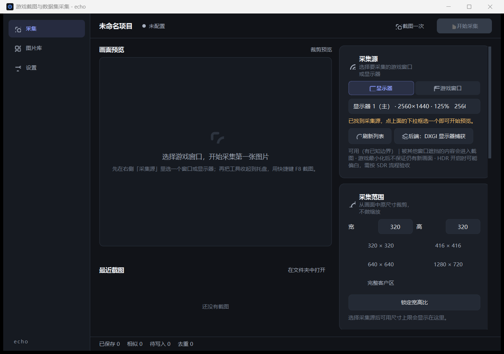

# echo · 游戏画面截图与 YOLO 数据集采集

[](LICENSE)
[](#一快速开始)
[](#一快速开始)
[](https://github.com/qianmocanyang/echo-yolo-capture/actions/workflows/ci.yml)

常驻托盘的 Windows 小工具。在游戏里按一下热键，就把**固定区域、固定尺寸**的画面截成 PNG；
攒够之后在工具里筛一轮，直接导出成 Ultralytics YOLO Detection 能吃的数据集。



## 更新记录

### v1.3.0（2026-09-14）

- **图片库管理**：删除选中（进回收站可还原）、复制路径、打开位置、右键单图菜单；
  失效记录自动分拣只清索引，修复混入失效路径导致整批删除失败的问题（错误码 124）
- **采集启动修复**：大选区切小屏不再永久禁用「开始采集」；下拉框假选中导致源从未生效的问题修复
- **热键修复**：字母/数字/标点不再允许无修饰键单独注册（裸 E 会吞掉全系统的 E 键），
  F 区/小键盘单键不受影响
- **跨设备兼容**：旧版 Windows 10 自动以带边框模式运行 WGC（修复
  "Toggling the capture border is not supported"）；识别管理员权限冲突并给出准确提示
- **性能**：采集后端按需交付节流（单核占用 97.8% → 约 3~15%），去重计算提速一倍
- **新增采集诊断**：设置页一键生成环境/后端/抓帧诊断报告，便于远程排障

### v1.2.0（2026-09-13）

- 全黑画面实时检测与针对性提示；设置页「采集诊断」入口

---

## 这个工具解决什么问题

用游戏画面做目标检测训练集，最费时间的其实不是标注，是**把原图搞到手**。

「切出游戏 → Win+Shift+S 拖框 → 保存 → 切回游戏」一张图两次切换，截几百张就废了。
换成录屏再抽帧，又会碰上另外三个问题：

| 问题 | 后果 |
| --- | --- |
| 手拖的框每次都不一样 | 目标在画面里的位置分布跟着漂移，模型学到的是「位置」而不是「特征」 |
| 尺寸不一致 | 标注框换算和缩放倍数容易出错，错了还不容易发现 |
| 连续帧几乎一样 | 白花标注时间，而且相邻帧分到 train/val 两边就是数据泄漏，验证指标虚高 |

所以这个工具整个围绕「**固定**」两个字做设计——固定选区、固定尺寸、固定节奏，再补上去重、
相似图标记和划分保护带。它不管标注，只负责把一批**干净、一致、不泄漏**的图交到你手上。

## 为什么不用它

- 你要的是**随手截一两张图**——用系统自带截图更快。
- 你的训练数据来自**公开数据集或录像归档**——不需要实时采集。
- 你的游戏是**全屏独占**且无法改成窗口/无边框——DXGI 在独占模式下会被阻断，工具取不到画面
  （这是 Windows 的限制，不是本工具的实现问题）。

---

## 一、快速开始

### 环境

- Windows 10 2004+ / Windows 11（窗口捕获依赖 Windows.Graphics.Capture，这是系统版本下限）
- Python 3.10+，实测 3.13

```bash
git clone https://github.com/qianmocanyang/echo-yolo-capture.git
cd echo-yolo-capture
python -m venv .venv
.venv\Scripts\pip install -r requirements.txt
.venv\Scripts\python main.py
```

也可以用 `python -m echo` 启动，两者走同一个入口。

### 首次使用


工具是**配置一次、之后收进托盘用快捷键**的形态，第一次需要按顺序做完这几步：

| 步骤 | 位置 | 说明 |
| --- | --- | --- |
| 1 | 右侧「采集源」 | 选游戏窗口或显示器。窗口模式不受遮挡影响，优先选窗口 |
| 2 | 右侧「采集范围」 | 选预设或手填宽高。点「拖拽定位」可以直接在画面上框 |
| 3 | 右侧「快捷键」 | 默认 F8 截图一次、F9 开始/暂停、Ctrl+Alt+E 唤出窗口 |
| 4 | 右侧「保存位置」 | 选一个空目录，工具会在里面建好固定结构 |
| 5 | 顶部主按钮 | 点「开始采集」，然后把窗口收进托盘，回游戏里按 F8 或 F9 |

窗口关闭按钮 = 收起托盘，不是退出。真正退出走托盘菜单的「退出」，或设置页里关掉
「关闭时收起到托盘」。

---

## 二、采集后端

两类采集源各有一个后端，能力不同。工具**不做静默降级**：窗口源只支持 WGC，
DXGI 是显示器专用的，切换会在界面上明说。

| 后端 | 适用源 | 失焦后能否继续 | 典型帧率 | 说明 |
| --- | --- | --- | --- | --- |
| Windows Graphics Capture | 窗口 / 显示器 | ✅ 能 | ~48 fps | 按窗口捕获，游戏窗口被遮挡也照常出帧 |
| DXGI Desktop Duplication | 仅显示器 | ❌ 会被独占阻断 | 200+ fps | 延迟最低，但全屏独占游戏下取不到画面 |

捕获的是**客户区**，坐标全部换算到客户区原点，DPI 全程按物理像素处理。多显示器、
125% / 150% 缩放都不会让选区偏移。

**采集不影响游戏帧率**：后端按需交付帧（默认约 10 fps，连拍时自动放宽），
不会以 60 fps 全速复制整屏——1080p 下这会把单个核心吃到 97%，压到 10 fps 后
只需 5%。每帧做一次抽样亮度检查，连续 6 秒全黑（独占全屏 / HDR / 双显卡的
典型表现）会自动暂停采集并给出针对性的排查提示，而不是默默存下一堆黑图。

**抓不到画面？** 设置页底部有「采集诊断」：在本机把环境、后端能力、实际抓帧
（含黑屏判定）完整跑一遍并给出结论，报告自动存到日志目录（`%APPDATA%\echo\logs\`），
可以直接发给开发者。命令行等价物是 `python tools/diagnose_capture.py`。

---

## 三、保存目录结构

工具只往你选的目录里写，不在应用目录留数据，方便整目录搬到训练机。

```
你选的目录/
├─ images/<批次号>/session_20260913_001_153012456_000007.png   # 原图，PNG 无损
├─ labels/<批次号>/                                            # 标注（YOLO 格式）
├─ metadata/
│  ├─ dataset.db            # SQLite 索引：批次、图片、审核状态、去重标记
│  └─ manifest.jsonl        # 追加式清单，db 丢了也能重建
└─ exports/<导出批次>/       # 导出的数据集
```

- **命名规则**：`session_<日期>_<批次序号>_<时间戳毫秒>_<序号>.png`，天然按时间排序。
- **写入是原子的**：先写 `.part`，fsync，再同目录重命名，最后才提交数据库。断电最多丢
  最后一张，不会留半个坏文件。启动时会自动清理 `.part` 并把漏登记的孤儿图片补进库。
- **配置与日志**在 `%APPDATA%\echo\`。设环境变量 `ECHO_DATA_DIR` 可以改到别处（便携模式
  或多套配置并行）。

---

## 四、导出的数据集

```
exports/export_20260913_160000/
├─ images/{train,val,test}/       # 原图直接复制，不重新编码，像素与源一致
├─ labels/{train,val,test}/       # 同名 .txt，0 字节表示「确认无目标」的背景样本
├─ data.yaml                      # Ultralytics 直接可用
├─ classes.json                   # 冻结的类别映射，便于复现
├─ split_manifest.json            # 每个样本去了哪个集合、哪些被保护带淘汰
└─ export_report.txt              # 人类可读的导出报告
```

划分策略按批次数量自动选择：

| 策略 | 触发条件 | 做法 |
| --- | --- | --- |
| `session` | 批次 ≥ 3 个 | 整批次分配。相邻帧天然同属一个集合，不存在泄漏 |
| `contiguous` | 批次 < 3 个 | 批次内按时间连续切块，**刀口两侧留保护带**，被淘汰的帧单独记录 |

保护带是防泄漏的手段，所以宽度会按可用帧数收缩（每段至少保留 1 帧）——固定宽度会让
小数据集的 val 段被吃空，整个批次退回 train，验证集永远是空的。

样本不足 6 张时不划分，全部进 train 并在报告里说明。

---

## 五、自检

代码改动后跑一遍：

```bash
python tools/selfcheck.py          # 五道检查，约 20 秒
python tools/selfcheck.py --fast   # 只跑静态检查，不启动 Qt
```

| 检查 | 能发现的问题 | CI |
| --- | --- | :---: |
| `tools/check_attrs.py` | `self.xxx` 调用了但没定义——语法合法，跑到那行才崩 | ✅ |
| `tools/selfcheck_imports.py` | 循环导入、语法错误、缺依赖（含 Qt 与采集后端） | ✅ |
| `tests/test_logic.py` | 选区算错、标注坐标换算错、划分泄漏、DB 与写盘逻辑错（49 个用例） | ✅ |
| `tools/smoke_ui.py` | 控件构造失败、信号连接错、页面切换崩 | ✅ |
| `tools/smoke_boot.py` | DPI 声明时序、单实例锁、Qt 初始化、异常钩子 | ❌ |

前四道由 [GitHub Actions](.github/workflows/ci.yml) 在 `windows-latest` 上跑，提 PR 会自动检查。

`smoke_boot.py` 没有放进 CI：它会真的注册全局热键并抢占单实例锁，在无人值守的 runner 上
不够稳定，只适合本地跑。

`check_attrs.py` 默认只报告、退出码恒为 0（静态分析难免有误报，需要人工判定）；
加 `--strict` 才会在发现问题时返回 1，CI 用的是这个模式。

界面相关的两个冒烟用 Qt 的 `offscreen` 平台插件跑，不需要真实屏幕。它们的数据目录指向
临时目录（环境变量 `ECHO_DATA_DIR`），不会碰你真实的配置。

也可以直接用 unittest 跑业务逻辑：

```bash
python -m unittest discover -s tests
```

---

## 六、打包

```bash
python tools/make_icon.py            # 生成 assets/echo.ico（已提交，通常不用重跑）
pip install pyinstaller
pyinstaller echo.spec --noconfirm
```

产物在 `dist/echo/echo.exe`：目录约 236 MB，exe 本体约 5.5 MB，其余是 Qt 与采集后端。

用**目录模式**而不是单文件，三个原因：单文件每次启动都要把几百 MB 的 Qt 解压到临时
目录，冷启动好几秒，而这是个常驻托盘的工具；目录模式下采集后端的 DLL 出问题能单独
替换排查；单文件会把内容解到 `%TEMP%\_MEIxxxx`，而部分反作弊会盯着这类临时目录。
打包后无控制台窗口，日志照常写到 `%APPDATA%\echo\logs`。

**验证打包产物**——不是跑源码，是真的启动那个 exe：

```bash
python tools/shot_exe.py             # 启动 dist/echo/echo.exe，把主窗口抓成 PNG
python tools/shot_exe.py --src       # 同样流程跑源码版，用来区分「打包特有」和「代码本身」
python tools/shot_exe.py out.png     # 指定输出路径
```

这一步覆盖的是前面所有冒烟都覆盖不到的东西：Qt 插件、字体、QSS、资源路径在冻结
环境里的真实表现。

**资源定位注意**：PyInstaller 6.0 起 `datas` 被收进 `dist/echo/_internal/`，
不再平铺在 exe 旁边。所以运行时代码用 `paths.resource_root()`（即 `sys._MEIPASS`）定位
只读资源，而 `paths.bundle_root()` 语义是「用户看得见、能搬走」的位置（exe 所在目录），
两者不要混用——混了就是「源码正常、打包后找不到文件」。

---

## 七、排障

| 现象 | 原因与处理 |
| --- | --- |
| 快捷键没反应 | 被别的程序占了。设置页会列出注册失败的项，换一个组合即可 |
| 窗口采集一直「等待画面」 | WGC 只在窗口重绘时交付新帧。静态窗口不出帧是正常行为，不是卡死 |
| 截图全是黑的 / 抓不到游戏内容 | 先跑设置页的「采集诊断」。全黑通常是：游戏独占全屏（改成无边框窗口）、开了 HDR（先关掉）、笔记本双显卡（游戏跑独显、采集核显输出，在「显示设置 → 图形」把游戏指定到同一块 GPU）。诊断报告会按你的机器给出具体结论 |
| 采集时游戏掉帧、CPU 高 | 已内置后端节流（默认约 10 fps 交付），旧版本才有此问题；若仍偏高，检查是否同时开了多路采集 |
| 全屏独占游戏截不到 | DXGI 在独占模式下会被阻断，改用窗口模式 + WGC |
| 选区位置偏了 | 检查是否多显示器 + 非 100% 缩放；启动日志里 `dpi_awareness=False` 说明声明失败 |
| 提示「保存位置不可用」 | 移动过保存目录，或盘符变了。重新选一次即可，数据库在目录里 |
| 提示「已经在运行」 | 全局热键是进程级独占资源，两个实例会互相抢注，所以做了单实例限制。从托盘打开已有实例 |
| 自检脚本报 `UnicodeEncodeError` | 控制台不是 UTF-8。英文版 Windows 的默认代码页是 cp1252，编码不了中文，脚本一打印中文就崩、退出码还是 1，看起来像「检查没通过」。设 `PYTHONUTF8=1` 再跑，或直接用 `python tools/selfcheck.py`（已内置该设置并会传给子进程） |

---

## 八、源码结构

```
echo/
├─ main.py / __main__.py     # 启动入口：DPI 声明 → 日志 → Qt → 单实例 → 窗口
├─ app.py                    # 应用门面，聚合配置、采集流水线、热键
├─ pipeline.py               # 采集流水线：状态机、有界队列、写盘线程、去重、重连
├─ region.py                 # 选区计算（物理像素，原点为采集源左上角）
├─ dpi.py                    # Qt 逻辑像素 ↔ Win32 物理像素换算
├─ paths.py                  # 配置/日志/资源目录，is_frozen 分支
├─ winapi.py                 # ctypes 绑定的 Win32：DPI、显示器/窗口枚举、热键
├─ config.py / quality.py    # 配置持久化、感知哈希与质量标记
├─ diagnose.py               # 采集链路诊断（界面按钮与 CLI 共用）
├─ hotkeys.py                # RegisterHotKey + WM_HOTKEY 事件过滤
├─ capture/                  # 采集后端：base / dxgi_monitor / wgc_window / factory
├─ storage/                  # naming / db / writer（原子写盘）/ manifest
├─ dataset/                  # labels（坐标换算）/ exporter / importer
└─ ui/                       # theme / icons / widgets / pages / tray / main_window

assets/echo.ico              # 应用图标（tools/make_icon.py 生成，已提交）
docs/screenshot.png          # 界面截图
echo.spec                    # PyInstaller 配置
LICENSE                      # MIT
.github/workflows/ci.yml     # CI：四道自检跑在 windows-latest
tools/                       # selfcheck / check_attrs / smoke_* / bench_capture / diagnose_capture
tests/test_logic.py          # 业务逻辑用例（49 个）
```

坐标系只有一套约定，写在 `region.py` 的模块注释里：**采集、坐标、PNG 全部用物理像素，
且相对采集源原点；逻辑像素只出现在 Qt 界面里，换算集中在 `dpi.py`。**

---

## 九、路线图 / 还没做的

详细的优化清单与优先级见 [`docs/roadmap.md`](docs/roadmap.md)，这里只列方向：

- **内置标注编辑器**：当前流程是从外部标注工具导入（`dataset/importer.py` 已支持
  Ultralytics 与 CVAT 两种格式）。内置编辑器的扩展点留在图库页的单元格双击事件上。
- **模型预标注与推理**：`pipeline` 的队列结构已支持插入外部产出的标注框，但未接模型。
  技术选型见 [`docs/auto-label-research.md`](docs/auto-label-research.md)。
- **训练集成**：训练脚本进不了这个包（AGPL-3.0 许可 + 打包版没有 Python 解释器 +
  需要独立显卡），形态是「echo 做环境编排 + 训练在独立进程跑」，设计见
  [`docs/roadmap.md`](docs/roadmap.md) 第二部分。
- **实机验收**：只在真实游戏里跑过一轮基础流程，多种引擎（Unity / Unreal / 全屏独占）
  下的表现还没系统验证过。

---

## 十、许可

[MIT](LICENSE) —— 可自由使用、修改、商用、再发布。

**唯一的要求是保留版权声明**，也就是注明出处。用在论文、视频、文章或衍生项目里时，
带上仓库链接即可：

> echo · 游戏画面截图与 YOLO 数据集采集 — <https://github.com/qianmocanyang/echo-yolo-capture>

---

## 十一、开发说明

- 项目照技术方案 v1.1 落地，范围是 **P0 全部 + P1 主体**（定时/连拍、批次管理、缩略图审核、
  去重与相似图标记、标注导入、YOLO 导出）；P2 留扩展点。
- 提交信息用约定式前缀 + 中文（`feat:` / `fix:` / `chore:`），正文里写清**为什么改**，
  不只是改了什么——这个项目的坑多半来自 Windows 的隐性行为，不记原因下次还得再踩。
- 提交前先跑 `python tools/selfcheck.py`，CI 会再挡一道。

